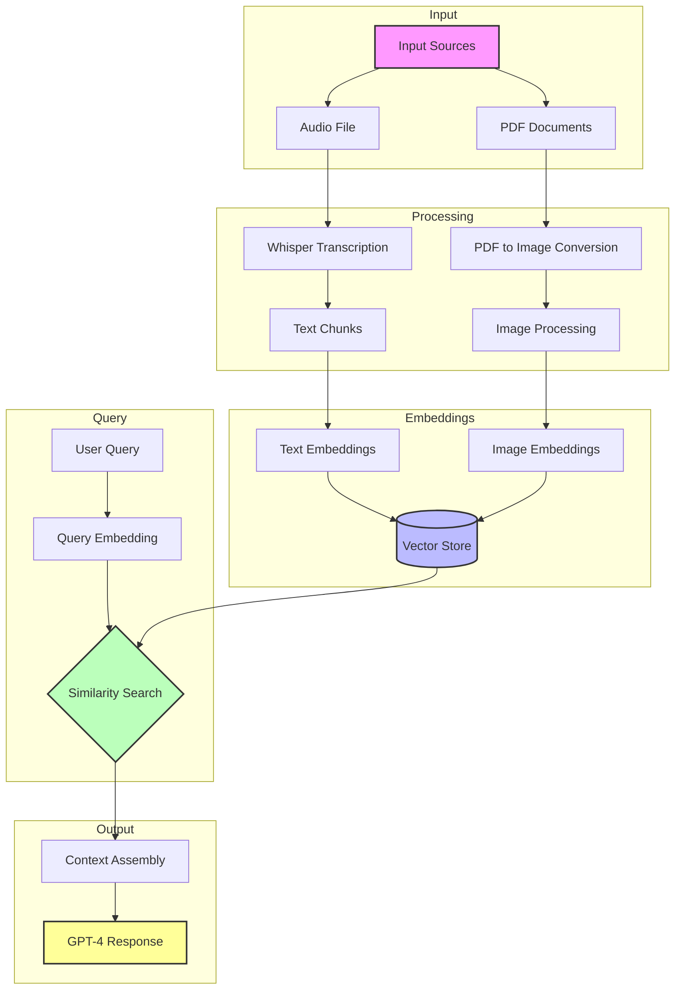
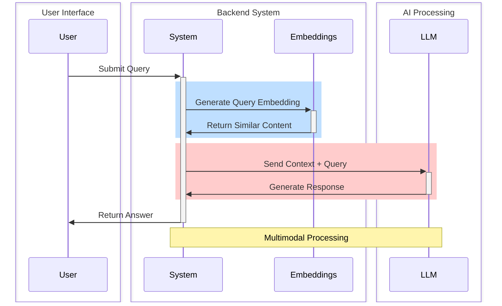

# 🌟 Multimodal RAG for Financial Analysis
<div align="center">
query = "You are a financial adviser. Answer based on the provided financial data."


[](https://www.python.org/)
[](https://jupyter.org/)
[](https://openai.com/)
[](LICENSE)

</div>

## 📚 Table of Contents
- [Overview](#-overview)
- [Key Features](#-key-features)
- [Project Architecture](#-project-architecture)
- [RAG Pipeline](#-rag-pipeline)
- [Installation](#-installation)
- [Project Structure](#-project-structure)
- [How It Works](#-how-it-works)
- [Results & Visualization](#-results--visualization)
- [Contributing](#-contributing)
- [License](#-license)

## 🎯 Overview

This project implements a sophisticated Multimodal RAG (Retrieval-Augmented Generation) system designed for comprehensive financial analysis of corporate performance. The system can process and analyze multiple types of financial data sources, making it a versatile tool for investors, analysts, and financial professionals.

To demonstrate the system's capabilities, we've implemented a case study using Starbucks Corporation's Q3 2024 financial data, showcasing how the tool handles various data formats:

### 📊 Demonstration Data Sources

1. **Earnings Call Audio** (`starbucks-q3.mp3`):
   - Quarterly earnings call recording
   - Executive presentations and Q&A sessions
   - Strategic discussions and market insights
   - Forward-looking statements and guidance

2. **Financial Report** (`3Q24-Earnings-Release.pdf`):
   - Quarterly financial statements
   - Performance metrics and KPIs
   - Market analysis and trends
   - Supporting charts and visualizations

### 🔄 System Capabilities

The system's architecture enables processing of any company's financial data through:
- Automated audio transcription of earnings calls and presentations
- Intelligent PDF processing and image extraction
- Advanced embedding techniques for multimodal data
- Semantic search across all data formats
- Context-aware information retrieval and synthesis

This creates a versatile financial analysis tool that can:
- Process multiple data formats simultaneously
- Answer complex financial queries
- Cross-reference information across different sources
- Generate comprehensive insights with supporting evidence
- Adapt to different companies and financial contexts

<div align="center">

</div>

The implementation demonstrates how modern AI techniques can revolutionize financial analysis by making it easier to process, understand, and derive insights from complex financial information across multiple formats and sources. While demonstrated with Starbucks' data, the system is designed to be adaptable to any company's financial documentation and reporting structure.

## 🚀 Key Features

- **Audio Transcription**: Converts earnings call recordings to text using Whisper
- **PDF Processing**: Extracts and processes financial reports and presentations
- **Multimodal Embeddings**: Generates embeddings for both text and images
- **Semantic Search**: Implements cosine similarity for relevant information retrieval
- **Intelligent Response Generation**: Uses GPT-4 for generating financial insights
- **Visual Analysis**: Processes financial charts and graphs from reports

## 🏗 Project Architecture



## 🔄 RAG Pipeline



## 🛠 Installation

```bash
git clone https://github.com/yourusername/MuliModal-Rag-for-starbucks.git
cd MuliModal-Rag-for-starbucks
pip install -r requirements.txt
```

## 📁 Project Structure

```
MuliModal-Rag-for-starbucks/
├── _asserts/                  # Visualization assets
├── images/                    # Processed PDF images
├── transcript/                # Audio transcriptions
├── Capstone Project - Multimodal Data.ipynb  # Main notebook
├── requirements.txt           # Dependencies
├── starbucks-q3.mp3          # Audio input
└── 3Q24-Earnings-Release.pdf  # PDF input
```

## ⚙️ How It Works

1. **Audio Processing**
   <div align="center">
   
   </div>
   
   - Transcribes audio using Whisper
   - Splits text into manageable chunks
   - Generates embeddings for each chunk

2. **PDF Processing**
   <div align="center">
   
   </div>
   
   - Converts PDF pages to images
   - Processes financial charts and tables
   - Creates embeddings for visual content

3. **Data Preprocessing & Encoding**
   <div align="center">
   
   </div>
   
   - Converts images to base64 format for model input
   - Prepares data for CLIP model processing
   - Optimizes input format for OpenAI API

4. **Embedding Generation**
   <div align="center">
   
   
   </div>
   
   - Uses CLIP model for image embeddings
   - Employs Sentence Transformers for text
   - Maintains vector consistency

5. **Similarity Search**
   <div align="center">
   
   </div>
   
   - Implements cosine similarity
   - Retrieves relevant content
   - Combines multimodal results

6. **Response Generation**
   <div align="center">
   
   </div>
   
   - Assembles retrieved context
   - Generates comprehensive answers
   - Provides financial insights

## 📊 Results & Visualization

The system demonstrates impressive capabilities in analyzing Starbucks' financial performance through multimodal data processing:

### 🎯 Key Achievements

1. **Audio Analysis**
   - Successfully transcribed Q3 earnings call
   - Processed 142 text chunks with 512-dimensional embeddings
   - Achieved high transcription accuracy with Whisper model

2. **Visual Processing**
   - Converted 17 PDF pages to high-quality images
   - Generated consistent 512-dimensional CLIP embeddings
   - Maintained visual context through document processing

3. **Retrieval Performance**
   - Achieved cosine similarity scores > 0.90 for relevant content
   - Top-5 audio chunk similarities: 0.90-0.91 range
   - Effective multimodal context assembly

### 🖼️ Image Preprocessing for OpenAI

A crucial step in our pipeline is preparing images for the OpenAI model. This involves:

<div align="center">

</div>

**Process Highlights:**
- Converting images to base64 format
- Optimizing image resolution and quality
- Preparing batch processing for multiple images
- Ensuring proper formatting for API input
- Managing memory efficiency for large documents

This preprocessing step is essential for:
- Maintaining image quality
- Optimizing API performance
- Ensuring accurate visual analysis
- Enabling efficient multimodal processing

### 📈 Example Query Analysis

#### Query
```
How is the company doing financially?
```

#### System Response
<div align="center">

</div>

The system generated a comprehensive analysis that included:

**Financial Metrics:**
- Q3 total company revenue: $9.1 billion (↑1% YoY, ↑6% QoQ)
- Global comparable store sales declined 3% year over year
- Operating margins contracted by 70 basis points to 16.7%
- Earnings per share: 93 cents

**Regional Performance:**
- North America: -2% Comcro
- China: -14% Comcro
- Strong performance in Japan
- International challenges, particularly in China

**Strategic Insights:**
- Implementation of three-part action plan
- Operational improvements in US stores
- Enhanced customer experience initiatives
- Digital engagement metrics

**Future Outlook:**
- Planned improvements in store operations
- Strategic investments in partner hours
- Expansion plans in tier 2 and tier 3 cities
- Technology deployment roadmap

The system successfully combined information from:
- Earnings call audio transcription
- Financial statements and metrics
- Visual data from presentations
- Management commentary and guidance

This demonstrates the system's ability to:
1. Process complex financial queries
2. Synthesize information from multiple sources
3. Present structured, comprehensive analysis
4. Provide both quantitative and qualitative insights

## 🤝 Contributing

Contributions are welcome! Please feel free to submit a Pull Request.

## 📄 License

This project is licensed under the MIT License - see the LICENSE file for details.

---
<div align="center">
Made with ❤️ for financial analysis
</div> 
